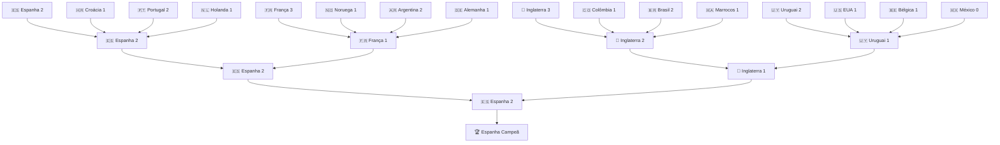

# Plano: Componente de Chaveamento Visual (TournamentBracket)

Proposta para adicionar uma seção interativa mostrando a árvore do mata-mata (Bracket) da Copa do Mundo 2026, projetada a partir das oitavas de final (Round of 16) até a grande final, exibindo os confrontos mais prováveis e os resultados simulados com base nas estatísticas do site.

---

## Proposta de Design e Layout

### 🎨 Visual & UX
1. **Estrutura de Chaveamento (Tree):**
   - Quatro colunas horizontais em telas grandes (Oitavas, Quartas, Semifinal, Final).
   - Conectores visuais (linhas) mostrando a progressão dos vencedores.
   - Responsividade: Em telas móveis, exibirá um seletor de fase (Oitavas / Quartas / Semis / Final) ou scroll horizontal suave com indicação visual para melhor legibilidade.

2. **Cards de Jogos (Match Cards):**
   - Nome das seleções com suas bandeiras dinâmicas (via FlagCDN).
   - Placar projetado (ex: `Espanha 2 · 1 Portugal`).
   - Indicação visual do vencedor (texto em negrito com badge dourado e perdedor com opacidade reduzida).
   - Estatística de probabilidade de vitória impressa diretamente no card do jogo (ex: `Espanha 60% vs 40% Portugal`).

---

## Proposta de Dados (matchups)

Baseado no modelo de probabilidade do site, a chave projetada terá os seguintes confrontos de mata-mata:

---

## Alterações Propostas

### 1. Novo Componente

#### [NEW] [TournamentBracket.vue](./app/components/TournamentBracket.vue)
- Componente que renderiza a estrutura de chaveamento flexível e responsiva.
- Armazenará o JSON com os dados dos jogos (times, placares, probabilidade de vitória, fase).
- Implementará o alternador de abas de fases para visualização móvel.

### 2. Integração

#### [MODIFY] [index.vue](./app/pages/index.vue)
- Importação e inserção do `<TournamentBracket />` entre `<TournamentPath />` e `<RecentFormChart />`.

---

## Plano de Verificação

### Testes Manuais
- Verificar renderização responsiva do chaveamento no Chrome (modo Mobile e Desktop).
- Confirmar que as bandeiras da FlagCDN renderizam sem problemas em todos os confrontos.
- Garantir contraste visual tanto no tema claro quanto no escuro (dark mode).
